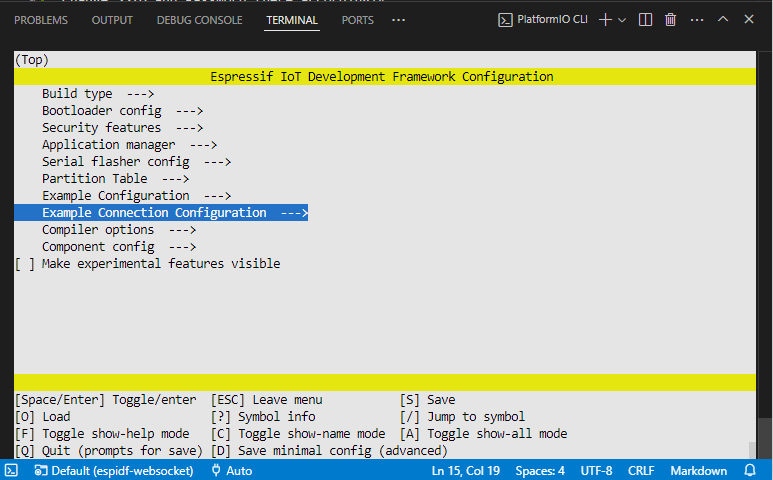
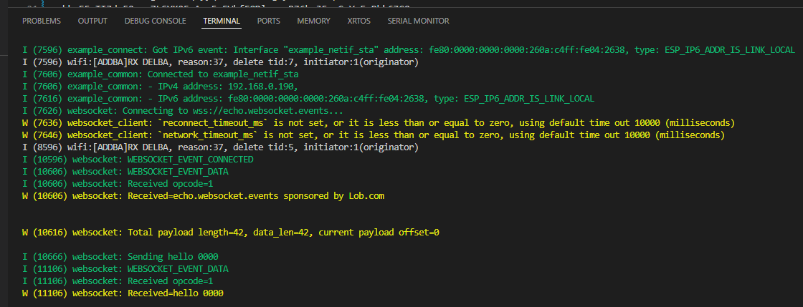

# pio-espidf-webclient

Documentation see https://github.com/espressif/esp-protocols/tree/websocket-v1.2.3/components/esp_websocket_client/examples/target

## Config

[PIO Core CLI](https://docs.platformio.org/en/latest/integration/ide/vscode.html#platformio-core-cli) -> `pio run -t menuconfig`

Change SSID and Password there accordingly.

By default, this example will try to connect to wss://echo.websocket.events (WebSocketSecure) and validate the server certificate using the `src/certs/ca_certificate_public_domain.pem` file. It will not use a client certificate.

The behavior should be that all data that the ESP32 sends to the websocket is echoed back by the server.

## Expected output

